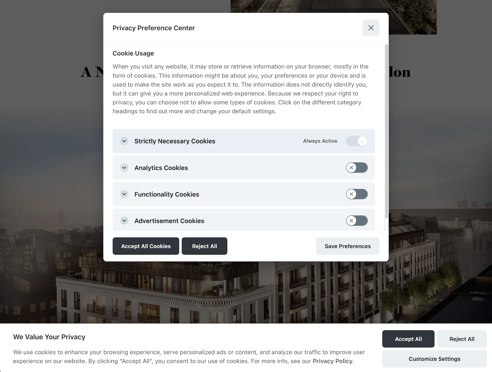

# Consent Mode Setup

Steps to setup Google Consent Mode in a React.js project and Google Tag Manager



## Install and Setup Cookie Consent Banner

- `yarn add vanilla-cookieconsent`
- Add `useCookieBanner` hook and customize text/options (reference [docs](https://cookieconsent.orestbida.com/reference/api-reference.html) for available options)
- Add to any pages needing the banner: eg `useCookieBanner({ lang: 'en', privacyPolicyUrl: '/privacy-policy' })`
- Preferences modal can be reopened by calling `CookieConsent.showPreferences()`, eg from a "Cookie Preferences" button in the footer
- The `useCookieBanner` hook takes a config with two options:
  - `lang` sets the default language of the banner
  - `privacyPolicyUrl` sets the URL of the privacy policy page link

## Setup Google Tag Manager to Handle Consent Selection

- Enable consent mode in GTM container: Admin -> Container Settings -> Enable consent overview
- After setting up the Variables, Tags, and Triggers below, go into Tags -> Consent Overview (shield icon) and setup any additional consent needed for tags. Eg add Additional Consent: `ad_storage` to any Facebook Pixel tags.

### Variables

1. 1st Party Cookie: `cookie - cookieconsent`

- Cookie Name: `cc_cookie`
- URI-decode cookie: enabled

2. Custom JavaScript Variable: `cjs - consent - analytics`

```
function() {
  var cookie = {{cookie - cookieconsent}}
  if (!cookie) {
    return 'denied'
  }
  var json = JSON.parse(cookie)
  if (json["categories"].indexOf('analytics') !== -1) {
    return 'granted'
  } else {
    return 'denied'
  }
}
```

3. Custom JavaScript Variable: `cjs - consent - functionality`

```
function() {
  var cookie = {{cookie - cookieconsent}}
  if (!cookie) {
    return 'denied'
  }
  var json = JSON.parse(cookie)
  if (json["categories"].indexOf('functionality') !== -1) {
    return 'granted'
  } else {
    return 'denied'
  }
}
```

4. Custom JavaScript Variable: `cjs - consent - marketing`

```
function() {
  var cookie = {{cookie - cookieconsent}}
  if (!cookie) {
    return 'denied'
  }
  var json = JSON.parse(cookie)
  if (json["categories"].indexOf('marketing') !== -1) {
    return 'granted'
  } else {
    return 'denied'
  }
}
```

5. GTM Consent State variable template: `Consent State`

- Variables -> User-Defined Variables -> New -> Community Template Gallery -> GTM Consent State by Ayudante

### Tags

Tags -> Community Template Gallery -> Consent Mode (Google tags) by gtm-templates-simo-ahava

We need to setup two instances of this tag:

1. `Consent Mode - Default Settings`

- Consent Command: `Default`
- Wait for Undate: `2000`
- Required for Google services / Other signals: update to use variables `{{cjs - consent - marketing|analytics|functionality}}`
- Firing Triggers: `Consent Initialization: All Pages`

2. `Consent Mode - Update Settings`

- Consent Command: `Update`
- Required for Google services / Other signals: update to use variables `{{cjs - consent - marketing|analytics|functionality}}`
- Firing Triggers: `custom event - consent updated`

### Triggers

1. Custom Event: custom event - consent initial selection

- Event name: `consent_initial_selection`
- Should trigger all Google/FB/Linkedin/etc tags that usually trigger on All Page View trigger

2. Custom Event: custom event - consent updated

- Event name: `consent_update`
- Should trigger `Consent Mode - Update Settings` tag

## Useful Links

### CookieConsent package

- CookieConsent Docs https://cookieconsent.orestbida.com/essential/getting-started.html
- CookieConsent v3 Playground https://playground.cookieconsent.orestbida.com/
- CookieConsent Next.js 13 example: https://stackblitz.com/edit/stackblitz-starters-gobdmp

### GTM consent mode installation

- How to install a Consent Mode Cookie Banner with GTM (Part 1) https://www.youtube.com/watch?v=In4TNHLTz_Y
- How to Install Consent Mode V2 (with GTM and Cookiebot) https://www.youtube.com/watch?v=KVXnCdImOSk

### GDRP compliance info

- Cookie Consent Banner Checklist: https://cookie-script.com/blog/cookie-consent-banner-checklist
- GDRP Cookie Compliance Checklist: https://cookieinformation.com/resources/blog/checklist-to-collecting-valid-cookie-consent-in-the-era-of-the-gdpr/
